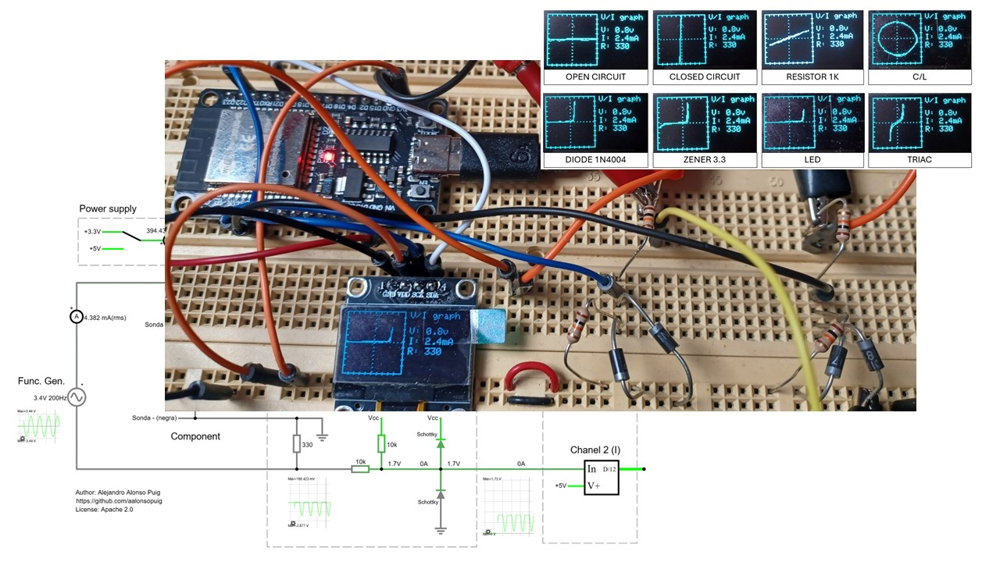
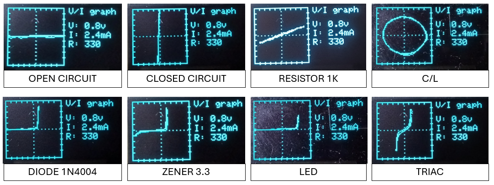
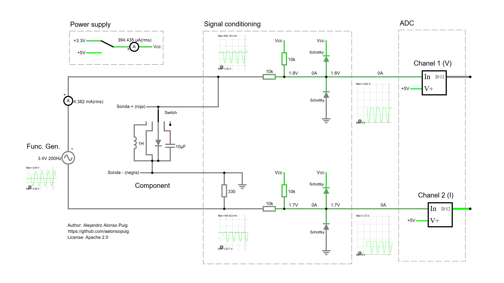
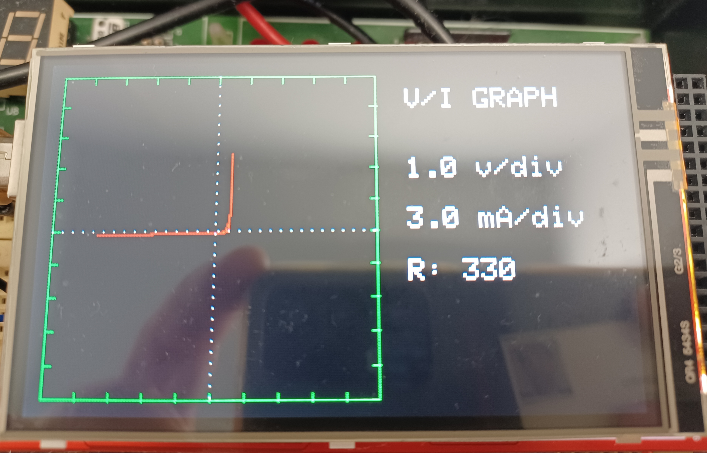

# V/I analyzer

Simple V/I curve analyzer based on ESP32 and SSD1306 OLED display.
Note: There is also an arduino mega version refered at the end of this document.




## Description

This project implements a very simple V/I (Voltage / Current) curve analyzer using an ESP32, an OLED display and an external function generator.

The system works similarly to the X/Y mode of an oscilloscope.

The measured component is connected in series with a fixed resistor. The system simultaneously measures:

- Voltage across the component under test
- Voltage across the series resistor

Using Ohm's law, the current through the component is calculated from the voltage measured across the resistor.

The generated X/Y graph represents:

- X axis → Voltage (V)
- Y axis → Current (I)


## Basic Operating Principle

The test circuit is:

```text
Function Generator ---> Series Resistor ---> DUT ---> Generator Return
```

Where:

- DUT = Device Under Test
- Series resistor initially used: **330 ohm**

The ESP32 measures:

- Channel 1 (V): voltage across the DUT
- Channel 2 (I): voltage across the series resistor

Current is obtained from:  I = Vr/R

Where:

- Vr = voltage across the series resistor
- R = 330 ohm


## Expected Curves

Different electronic components generate characteristic V/I patterns.

Some expected examples are:

| Component | Expected Shape |
|---|---|
| Open circuit | Horizontal line |
| Short circuit | Vertical line |
| Resistor | Straight diagonal line |
| Capacitor | Ellipse |
| Inductor | Tilted ellipse |
| Rectifier diode | One-sided conduction curve |
| LED | Diode curve with higher forward voltage |
| Zener diode | Reverse breakdown region |
| TRIAC | Bidirectional switching behavior |




## Signal Source

An external function generator is required.

Recommended initial configuration:

- Waveform: sine
- Vpp: 7V
- Frequency: 200Hz

Frequency may be increased depending on the tested component.

Important:

The function generator ground MUST NOT be directly shared with the internal signal conditioning stages unless the complete circuit grounding scheme is properly understood.


## System Architecture

The system consists of two main parts:

### 1. Analog Signal Conditioning

The ESP32 ADC only accepts positive voltages between:

```text
0V ... 3.3V
```

Therefore, the input signals are conditioned externally:

- shifted to positive voltages
- limited to safe ADC ranges
- protected with clamp diodes

The conditioning circuit converts bipolar signals into safe unipolar ADC-compatible signals.


[Falstad simulation](https://is.gd/OAPqy9)


### 2. ESP32 + OLED Display

The ESP32 performs:

- ADC acquisition
- zero calibration
- X/Y mapping
- graph rendering

The OLED display shows:

- V/I graph
- voltage scale per division
- current scale per division


## OLED Display

Display used:

- SSD1306 OLED
- 128x64 pixels
- I2C interface
- monochrome

The graph occupies the left side of the screen.

The right side displays measurement information.


## ESP32 Connections

### OLED Connections

| OLED Pin | ESP32 Pin |
|---|---|
| VCC | 3V3 |
| GND | GND |
| SDA | GPIO21 |
| SCL | GPIO22 |


### Analog Inputs

| Function | ESP32 Pin |
|---|---|
| Voltage channel (V) | GPIO34 |
| Current channel (I) | GPIO35 |

ADC1 pins are intentionally used because they behave better on ESP32 systems.


## Display Information

The OLED shows:

- X/Y V/I graph
- Voltage scale per division
- Current scale per division

The graph includes:

- square grid
- center axes
- division marks


## Software Features

Current firmware features:

- automatic zero calibration at startup
- real-time X/Y plotting
- bipolar signal mapping
- dotted center axes
- graphical grid
- OLED information area


## Hardware Notes

Important:

- Inputs must NEVER exceed 3.3V at ESP32 ADC pins
- External protection circuitry is mandatory
- Analog conditioning is required before ADC connection


## Future Improvements

Possible future improvements include:

- larger TFT display
- ESP32 DMA optimizations
- trigger modes
- automatic scaling
- selectable shunt resistors
- frequency measurement
- FFT analysis
- external ADCs
- waveform persistence
- USB serial data export

---
# Arduino Mega Version

The repository also includes an alternative implementation for Arduino Mega:

```text
vi_analyzer_arduino
```

This version was adapted to work with a 3.6" TFT shield based on the ILI9327 controller using parallel communication.



Although the larger color display provides a more instrument-like appearance, the overall performance is significantly limited by:
- the Arduino Mega processing power,
- the relatively slow TFT refresh,
- the cost of repeatedly drawing the V/I curve.

As a result, noticeable screen flickering and limited refresh rates are present during operation.

For this reason, the ESP32 implementation is currently considered the preferred version of the project, despite using a much smaller monochrome OLED display.